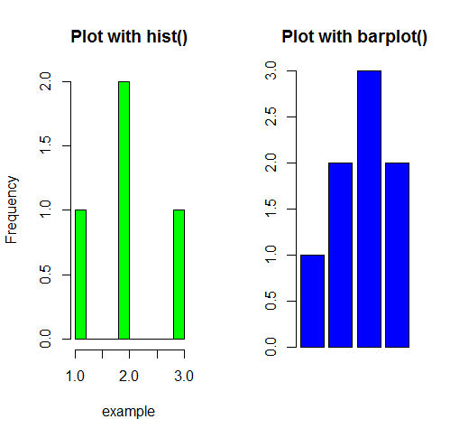
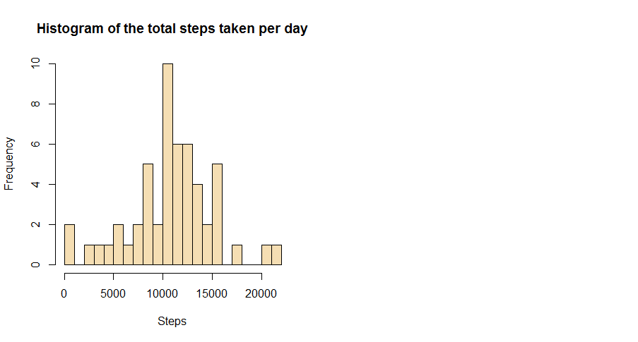
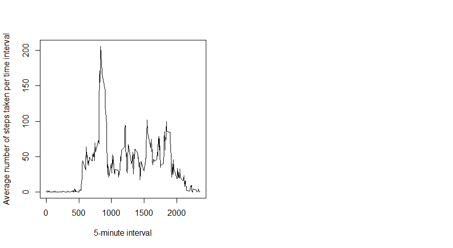
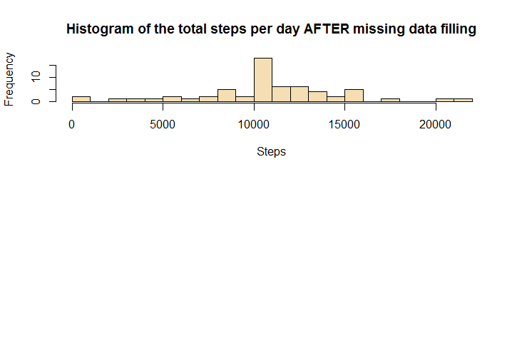
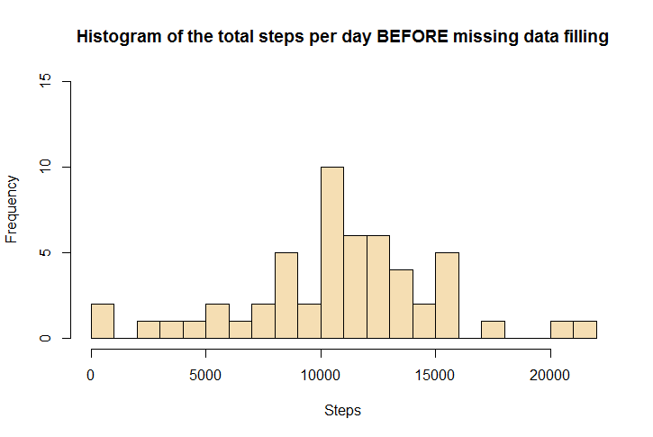
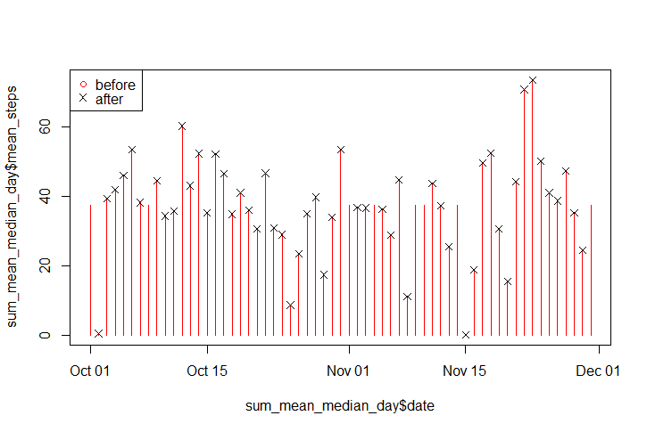
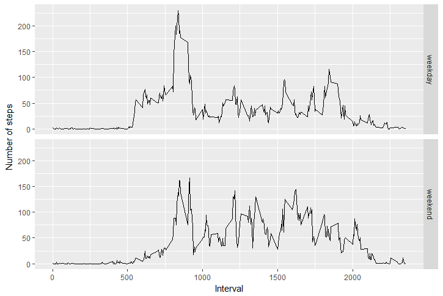
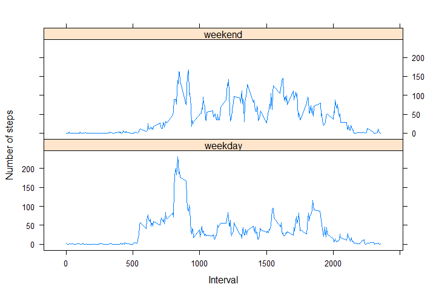

```{r setup, include=FALSE}
knitr::opts_chunk$set(echo = TRUE)
```

### R Markdown, This is an R Markdown document. 

### Reproducible Research Week 2 Course Project 1

#### Loading and preprocessing the data
#### Show any code that is needed to


#### 1. Load the data (i.e. read.csv()).

From the instructions, we knew the first line of the file "activity.csv" is its variable names and na.strings should be setted as "NA".

```
setwd("C:/Users/user/Documents/practice")
getwd() 

csv <- "./activity.csv"
activity <- read.csv(csv)
str(activity)

```

```
 # 'data.frame':    17568 obs. of  3 variables:
 # $steps   : int  NA NA NA NA NA NA NA NA NA NA ...
 # $date    : Factor w/ 61 levels "2012-10-01","2012-10-02",..: 1 1 1 1 1 1 1 1 1 1 ...
 # $interval: int  0 5 10 15 20 25 30 35 40 45 ...
```
```
 # head(activity)
 # tail(activity)
```

####2. Process/transform the data (if necessary) into a format suitable for your analysis.
####   We will only tranfer the date value to data format, which will be used later.

```
library(dplyr)
```

```
 # Attaching package: 'dplyr'
 # The following objects are masked from 'package:stats':
 
 # filter, lag
 # The following objects are masked from 'package:base':
 
 # intersect, setdiff, setequal, union
```

```
activity <- mutate(activity, date = as.Date(as.character(date), "%Y-%m-%d"))
```

####What is mean total number of steps taken per day?

1. Calculate the total number of steps taken per day.
   We can either use group_by and summarise functions of dplyr package or use aggregate          function to arrive our aim. Here, we use the later one.

```
steps_per_day <- aggregate(steps ~ date, data = activity, sum, na.rm = TRUE)
#steps_per_day
```

2. If you do not understand the difference between a histogram and a barplot, research the difference between them. Make a histogram of the total number of steps taken each day
Difference, 

A histogram is useful to look at when one want to see more detail on the distribution of a data. The barplot is useful for summarizing categorical data. The following is an example.

```
example <- c(1,2,3,2)
par(mfrow = c(1,2))  # number of plots per row    
hist(example, breaks = 8, col = "green", main = "Plot with hist()")  # plot by hist()
barplot(example, col = "blue", main = "Plot with barplot()")  # plot by barplot
```

Plot1


Now we draw a histogram of the total number of steps taken each day to investigate the steps distributions.

```
hist(steps_per_day$steps, main = "Histogram of the total steps taken per day", xlab = "Steps", breaks = 16, col = "wheat")
```
Plot2


3. Calculate and report the mean and median of the total number of steps taken per day.

The group_by and summarise/summarize functions of package dplyr are more convinent here.

```
library(dplyr)
mean_median_steps_per_day <- group_by(activity, date) %>%
    summarise(mean = mean(steps, na.rm = TRUE),
              median = median(steps, na.rm = TRUE))
head(mean_median_steps_per_day)
```
```
## # A tibble: 6 × 3
##         date     mean median
##       <date>    <dbl>  <dbl>
## 1 2012-10-01      NaN     NA
## 2 2012-10-02  0.43750      0
## 3 2012-10-03 39.41667      0
## 4 2012-10-04 42.06944      0
## 5 2012-10-05 46.15972      0
## 6 2012-10-06 53.54167      0
```
```
dim(mean_median_steps_per_day)
## [1] 61  3
```
####What is the average daily activity pattern?

1. Make a time series plot (i.e. type = "l") of the 5-minute interval (x-axis) and the average number of steps taken, averaged across all days (y-axis) 

```
interval_steps <- group_by(activity, interval) %>%
    summarise(mean = mean(steps, na.rm = TRUE))

with(interval_steps, 
     plot(interval, mean, 
          type = "l", 
          xlab = "5-minute interval",
          ylab = "Average number of steps taken per time interval"))
```
Plot3


2. Which 5-minute interval, on average across all the days in the dataset, contains the maximum number of steps?
```
max_steps_interval <- interval_steps$interval[which.max(interval_steps$mean)]
max_steps_interval
## [1] 835
```
Above calculation shows that the 5-minute interval 835 contains the maximum number of steps.

####Imputing missing values

Note that there are a number of days/intervals where there are missing values (Coded as NA) The presence of missing days may introduce bias into some calculations or summaries of the data.

1. Calculate and report the total number of missing values in the dataset (i.e. the total number of rows with NAs).

We have a first check on every column of the data activity, aiming to detect the NA values.

```
any(is.na(activity$steps))
## [1] TRUE
```

```
any(is.na(levels(activity$date)))
## [1] FALSE
## Warning in is.na(levels(activity$date)): is.na() applied to non-(list or
## vector) of type 'NULL'

```

```
any(is.na(activity$interval))
## [1] FALSE
```
As a result, one can find only the column steps in activity contains NAs. We will only need to focus on this column in the following.

```
NA_total <- sum(is.na(activity$steps))
NA_proportion <- sum(is.na(activity$steps)) / nrow(activity)
```
The total number of rows of missing values is 2304. It has a proportion of 0.1311475.

2. Devise a strategy for filling in all of the missing values in the dataset. The strategy does not need to be sophisticated. For example, you could use the mean/median for that day, or the mean for that 5-minute interval, etc.

Here is the strategy we used. Given a NA step value, we first try to fill it with the median of that day. If this median result is also NA, we then fill it with the mean for that 5-minute interval. In the end, we check the NA values of the new data.

3. Create a new dataset that is equal to the original dataset but with the missing data filled in.

```
activity_copy <- activity  # for a protection of the original data
rm(activity)  # release the memory
l <- nrow(activity_copy)
for (i in 1:l) {
    if (is.na(activity_copy$steps[i])) {
        today = activity_copy$date[i]
        sub_value = mean_median_steps_per_day[mean_median_steps_per_day$date == today, "median"]
        if (!is.na(sub_value)) {
            activity_copy$steps[i] = sub_value
        } else {
            pattern = activity_copy$interval[i]
            sub_value = interval_steps[interval_steps$interval == pattern, "mean"]
            activity_copy$steps[i] = sub_value
        }
    }
}

sum(is.na(activity_copy$steps))
## [1] 0
```

```
str(activity_copy)
## 'data.frame':    17568 obs. of  3 variables:
##  $ steps   :List of 17568
##   ..$ : num 1.72
##   ..$ : num 0.34
##   ..$ : num 0.132
##   ..$ : num 0.151
##   ..$ : num 0.0755
##   ..$ : num 2.09
##   ..$ : num 0.528
##   ..$ : num 0.868
##   ..$ : num 0
##   ..$ : num 1.47
##   ..$ : num 0.302
##   ..$ : num 0.132
##   ..$ : num 0.321
##   ..$ : num 0.679
##   ..$ : num 0.151
##   ..$ : num 0.34
##   ..$ : num 0
##   ..$ : num 1.11
##   ..$ : num 1.83
##   ..$ : num 0.17
##   ..$ : num 0.17
##   ..$ : num 0.377
##   ..$ : num 0.264
##   ..$ : num 0
##   ..$ : num 0
##   ..$ : num 0
##   ..$ : num 1.13
##   ..$ : num 0
##   ..$ : num 0
##   ..$ : num 0.132
##   ..$ : num 0
##   ..$ : num 0.226
##   ..$ : num 0
##   ..$ : num 0
##   ..$ : num 1.55
##   ..$ : num 0.943
##   ..$ : num 0
##   ..$ : num 0
##   ..$ : num 0
##   ..$ : num 0
##   ..$ : num 0.208
##   ..$ : num 0.623
##   ..$ : num 1.62
##   ..$ : num 0.585
##   ..$ : num 0.491
##   ..$ : num 0.0755
##   ..$ : num 0
##   ..$ : num 0
##   ..$ : num 1.19
##   ..$ : num 0.943
##   ..$ : num 2.57
##   ..$ : num 0
##   ..$ : num 0.34
##   ..$ : num 0.358
##   ..$ : num 4.11
##   ..$ : num 0.66
##   ..$ : num 3.49
##   ..$ : num 0.83
##   ..$ : num 3.11
##   ..$ : num 1.11
##   ..$ : num 0
##   ..$ : num 1.57
##   ..$ : num 3
##   ..$ : num 2.25
##   ..$ : num 3.32
##   ..$ : num 2.96
##   ..$ : num 2.09
##   ..$ : num 6.06
##   ..$ : num 16
##   ..$ : num 18.3
##   ..$ : num 39.5
##   ..$ : num 44.5
##   ..$ : num 31.5
##   ..$ : num 49.3
##   ..$ : num 53.8
##   ..$ : num 63.5
##   ..$ : num 50
##   ..$ : num 47.1
##   ..$ : num 52.2
##   ..$ : num 39.3
##   ..$ : num 44
##   ..$ : num 44.2
##   ..$ : num 37.4
##   ..$ : num 49
##   ..$ : num 43.8
##   ..$ : num 44.4
##   ..$ : num 50.5
##   ..$ : num 54.5
##   ..$ : num 49.9
##   ..$ : num 51
##   ..$ : num 55.7
##   ..$ : num 44.3
##   ..$ : num 52.3
##   ..$ : num 69.5
##   ..$ : num 57.8
##   ..$ : num 56.2
##   ..$ : num 73.4
##   ..$ : num 68.2
##   ..$ : num 129
##   .. [list output truncated]
##  $ date    : Date, format: "2012-10-01" "2012-10-01" ...
##  $ interval: int  0 5 10 15 20 25 30 35 40 45 ...
```
```
The result shows that the format of the column steps is list. We first convert it to numeric.
activity_copy <- mutate(activity_copy, steps = as.numeric(steps))
write.csv(activity_copy, file = "activity_copy.csv") # save the new data
```

4. Make a histogram of the total number of steps taken each day and Calculate and report the mean and median total number of steps taken per day. Do these values differ from the estimates from the first part of the assignment? What is the impact of imputing missing data on the estimates of the total daily number of steps?

```
library(dplyr)
sum_mean_median_day <- group_by(activity_copy, date) %>%
    summarise(sum_steps = sum(steps),
              mean_steps = mean(steps),
              median_steps = median(steps))
sum_mean_median_day
## # A tibble: 61 × 4
##          date sum_steps mean_steps median_steps
##        <date>     <dbl>      <dbl>        <dbl>
## 1  2012-10-01  10766.19   37.38260     34.11321
## 2  2012-10-02    126.00    0.43750      0.00000
## 3  2012-10-03  11352.00   39.41667      0.00000
## 4  2012-10-04  12116.00   42.06944      0.00000
## 5  2012-10-05  13294.00   46.15972      0.00000
## 6  2012-10-06  15420.00   53.54167      0.00000
## 7  2012-10-07  11015.00   38.24653      0.00000
## 8  2012-10-08  10766.19   37.38260     34.11321
## 9  2012-10-09  12811.00   44.48264      0.00000
## 10 2012-10-10   9900.00   34.37500      0.00000
## # ... with 51 more rows
```
```
str(sum_mean_median_day)
## Classes 'tbl_df', 'tbl' and 'data.frame':    61 obs. of  4 variables:
##  $ date        : Date, format: "2012-10-01" "2012-10-02" ...
##  $ sum_steps   : num  10766 126 11352 12116 13294 ...
##  $ mean_steps  : num  37.383 0.438 39.417 42.069 46.16 ...
##  $ median_steps: num  34.1 0 0 0 0 ...
```

Now we plot histograms of the total steps taken per day AFTER and BEFORE the filling of missing data.

```
par(mfcol = c(2,1))

hist(sum_mean_median_day$sum_steps, main = "Histogram of the total steps per day AFTER missing data filling", xlab = "Steps", breaks = 16, col = "wheat")
hist(steps_per_day$steps, main = "Histogram of the total steps per day BEFORE missing data filling", xlab = "Steps", breaks = 16, col = "wheat", ylim = c(0,15))
```

Plot 4 


Plot 5



Next we plot the mean steps taken per day AFTER and BEFORE the filling of missing data.

```
plot(sum_mean_median_day$date, sum_mean_median_day$mean_steps, type = "h", pch = 1, col = "red")
points(mean_median_steps_per_day$date, mean_median_steps_per_day$mean, pch = 4)
legend("topleft", pch = c(1,4), col = c("red", "black"), legend = c("before", "after"))
```
Plot6



The red vertical lines without crosses on the top indicates the missing in the original data.

####Are there differences in activity patterns between weekdays and weekends?

For this part the Weekdays() function may be of some help here. Use the dataset with the filled-in missing values for this part.

1. Create a new factor variable in the dataset with two levels - "weekday" and "weekend" indicating whether a given date is a weekday or weekend day.

```
class(activity_copy$date)

## [1] "Date"
```

```
state <- ifelse(weekdays(activity_copy$date) %in% c("Saturday", "Sunday"), "weekend", "weekday")
state <- as.factor(state)
activity_copy$state <- state
str(activity_copy)
```
```
## 'data.frame':    17568 obs. of  4 variables:
##  $ steps   : num  1.717 0.3396 0.1321 0.1509 0.0755 ...
##  $ date    : Date, format: "2012-10-01" "2012-10-01" ...
##  $ interval: int  0 5 10 15 20 25 30 35 40 45 ...
##  $ state   : Factor w/ 2 levels "weekday","weekend": 1 1 1 1 1 1 1 1 1 1 ...
```

2. Make a panel plot containing a time series plot (i.e. "l") of the 5-minute interval(x-axis) and the average number of steps taken, averaged across all weekday days or weekend days (y-axis). See the README file in the GitHub repository to see an example of what this plot should look like using simulated data.

```
library(dplyr)
average_steps_state <- group_by(activity_copy, state, interval) %>%
    summarise(average_steps = mean(steps))
str(average_steps_state)
```
```
## Classes 'grouped_df', 'tbl_df', 'tbl' and 'data.frame':  576 obs. of  3 variables:
##  $ state        : Factor w/ 2 levels "weekday","weekend": 1 1 1 1 1 1 1 1 1 1 ...
##  $ interval     : int  0 5 10 15 20 25 30 35 40 45 ...
##  $ average_steps: num  2.251 0.445 0.173 0.198 0.099 ...
##  - attr(*, "vars")=List of 1
##   ..$ : symbol state
##  - attr(*, "drop")= logi TRUE

```

```
library(ggplot2)
g <- ggplot(average_steps_state, aes(x = interval, y = average_steps)) +
    geom_line() + 
    facet_grid(state ~ .) + 
    labs(x = "Interval") + 
    labs(y = "Number of steps")
g
```
Plot7


Let's plot above picture again using lattice system.

```
library(lattice)
xyplot(average_steps ~ interval | state, data = average_steps_state, type = "l", layout = c(1,2), xlab = "Interval", ylab = "Number of steps")

```
Plot8

